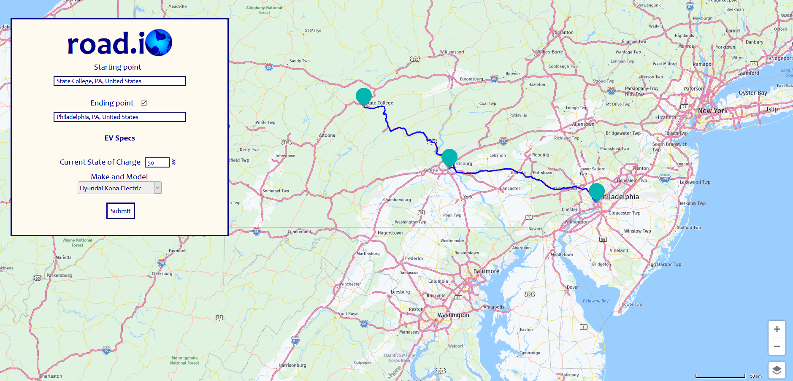
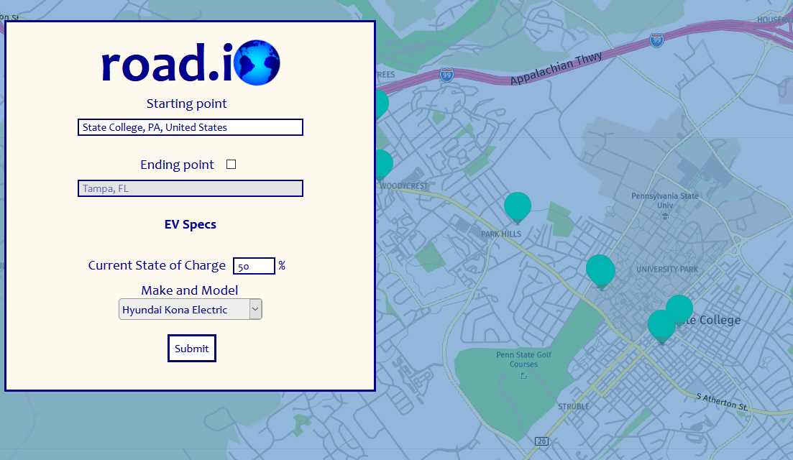
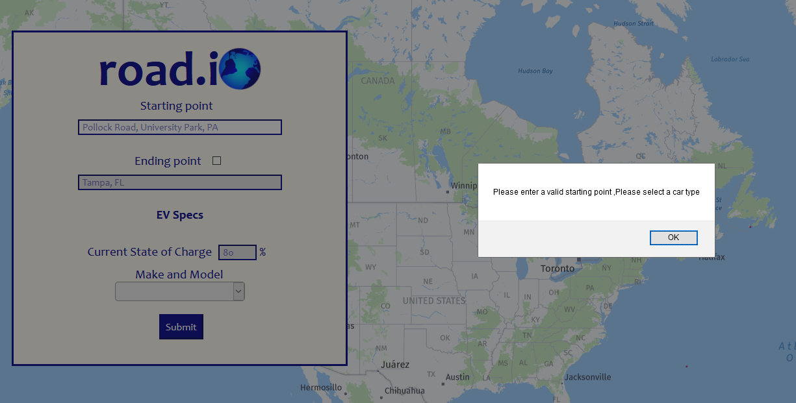

# Road.io Client
IST440W Capstone Project
- Operates in combination with [Road.io Server](https://github.com/connellboyce/road.io-server)

### Created by
- [Connell Boyce](https://github.com/connellboyce)
- [Kellia Cockerill](https://github.com/kelliacockerill)
- [Caden Martz](https://github.com/CadenRM)

### Table of Contents
1. [Components](#1-components)
2. [Dependencies](#2-dependencies)
3. [Plugins](#3-plugins)
4. [Use Cases](#4-use-cases)
5. [Project Demonstration](#5-project-demonstration)
6. [Developer Documentation](#6-developer-documentation)
7. [External Resources](#7-external-resources)

### **1**. Components
- Java 8
- Spring Boot 2.4.3
- Maven 3.6.3

### **2**. Dependencies
- Spring Framework
    - Starter Web
    - Starter Test
    - WebFlux
- ReactJS
- JUnit
    
### **3**. Plugins
- Maven
- Maven Project Info Reports
- Maven Javadoc
- Maven Site
- JaCoCo
    
### **4**. Use Cases
- User would like to travel from point A to point B but does not know where charging stations are located and cannot complete the trip without a charge.
    - Application opened
    - User checks the box to allow for an ending point
    - Origin, destination, percentage of charge currently remaining, and vehicle make and model are specified
    - User presses submit
    - Application provides routing for this trip with markers for origin, destination, and all charging stations.
- User would like to find charging stations nearby.
    - Application opened
    - User specifies origin and car make and model
    - User pressed submit
    - Application provides local charging stations and visualizes the radius the user is able to travel with their vehicle's charge as a blue-tinted circle    
    
### **5**. Project Demonstration
Road.io combines long distance route planning for electric vehicles with range visualization measures to directly combat common fears surrounding a switch to an electric vehicle.
- Landing page

- Long-distance route planning

- Displaying local charging stations

- Input validation

### **6**. Developer Documentation
- [Frontend Developer Notes](documentation/FRONTEND.md)
- [Backend Developer Notes](documentation/BACKEND.md)
- [Deployment Developer Notes](documentation/DEPLOYMENT.md)

### **7**. External Resources
- [HERE API](https://developer.here.com/documentation/geocoding-search-api/api-reference-swagger.html)
- [NREL API](https://developer.nrel.gov/)
- Spring Boot tutorials courtesy of [Baeldung](https://www.baeldung.com/)